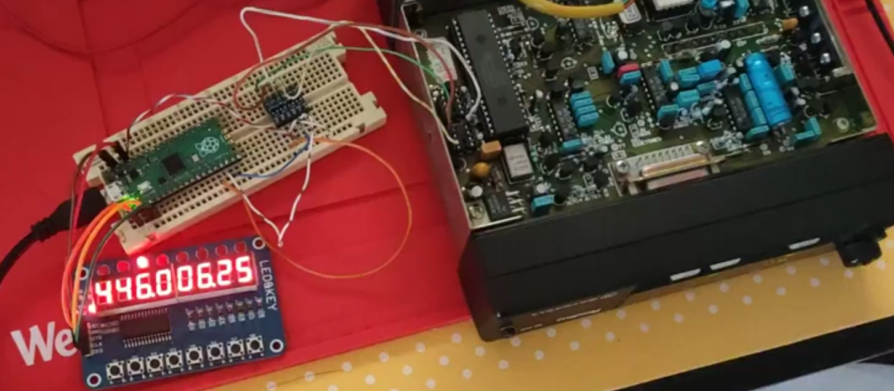
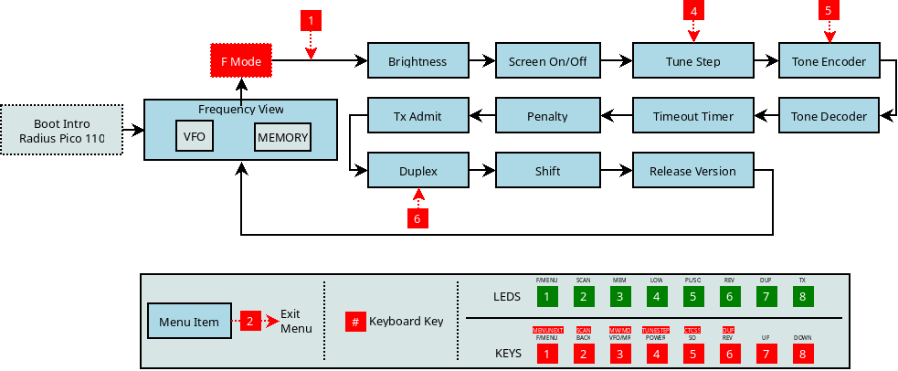

# Pico 110 



A Motorola Radius M110 mod / modification

## Description

This mod applies to the 2 channel Motorola Radius M110 radios and consists in 
the replacement of the eeprom by a microcontroller capable of behaving like a i2c
slave simulating a serial i2c 24c01 eeprom. 

Everytime the user switches channel the radio "pulls" the channel from the eeprom.

As a consequence, if we operate on top of the eeprom data and electronically switch
channels, triggering a new read in the internal organics of the frequency
synthesis.

Then, we can make a new frontal with very few changes on the equipment,
preserving it's original status.

## Prototyping

Based on this idea and taking in account some compromises, I proceeded to use a raspberry
pi pico board and a TM1638 board with 8 buttons and 8 leds. The drawback is the use of polling
for the buttons. A TFT display and some interrupts for keys would suit better.

With these modulesi we're able to indicate the frequency but with limited text representation.

## Menus / Features

- VFO Mode
- Memory Mode
- Tune Step (TS) (kHz)
- Encoder (Enc) (Hz + OFF)
- Decode (Dec) (Hz + OFF)
- Timeout Timer (TOT) (s)
- Timeout Rekey (DLY/TPY/Pen) (s)
- Reverse (Rev) (+/-) ***
- Repeater Mode/Duplex (Dup) +/- Shift MHz/kHz ***
- Power (P/PA/PO) Hi/Lo (Watts)
- TxAdmit (Tad = MO/AL/NC/NC.PL)

- Display Brightness **
- Screen On/Off (Or a clear so we can keep Leds) ** 
- Scanning (just memories, wip)

### Visual representation



This is a visual representation of the menu system. The unit boots and shows the 
frequency, either VFO or Memory. Then, by pressing the keys we can operate the radio 
as shown. The keys have a double function, a normal one and another when FUNC key was activated.

For example, by pressing key 1 (MENU/NEXT) the radio enters in MENU mode (F Mode) which will
be identified by the first led. Any other presses on the same key, will iterate over the menu.

When in this mode, pressing keys as indicated, will allow a jump to the corresponding menu
and pressing key 2 will exit F/MENU mode.

### Missing

- Memories Name (Or Memory nr - no text - wip)
- How to memorize, Edit, Remove (CRUD)
- Dual VFO with same/distinct steps etc. (Needed?)
- Mem to vfo (Operate a memory channel as a VFO. How to)

### New control head

- Need a way to open Squelch, hw
- 3D printed case

## Build

To build the firmware you **must install pico-sdk**. After installing the raspberry
pi pico C/C++ SDK, you need to, from this project path:

- Create a build folder, eg: build
- Remove it first if it exists
- cd into the build folder
- export the sdk path 
- invoke cmake pointing to the project CMakeLists.txt
- invoke make

for example:

```
$ cd ~/pico/pico110/
$ rm -rf build
$ mkdir build
$ cd build
$ export PICO_SDK_PATH=../../pico-sdk
$ cmake ..
$ make -j4
```

## Links

### I2C

- https://github.com/vmilea/pico_i2c_slave/

### TM1638

- https://github.com/mcauser/micropython-tm1638
- https://github.com/rjbatista/tm1638-library
- https://github.com/thilaire/rpi-TM1638
- https://github.com/wahlencraft/TM1637-pico
- https://github.com/lpodkalicki/attiny-tm1638-library
- https://github.com/gavinlyonsrepo/TM1638plus


---

## NOTES

...
