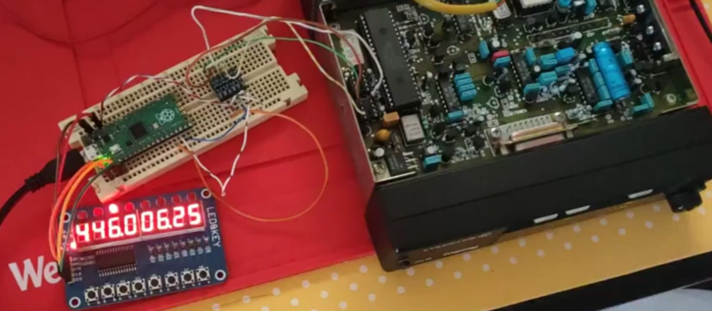

# M110 MOD

- VFO Mode
- Memory Mode (how)

## Menus / Features

- Tune Step (TS) (kHz)
- Encoder (Enc) (Hz + OFF)
- Decode (Dec) (Hz + OFF)
- Timeout Timer (TOT) (s)
- Timeout Rekey (DLY/TPY/Pen) (s)
- Reverse (Rev) (+/-) ***
- Repeater Mode/Duplex (Dup) +/- Shift MHz/kHz ***
- Power (P/PA/PO) Hi/Lo (Watts)
- TxAdmit (Tad = MO/AL/NC/NC.PL)

- Display Brightness **
- Screen On/Off (Or a clear so we can keep Leds) ** 

### Missing

- Scanning
- Memories (Name and Frequency)
- How to memorize, Edit, Remove (CRUD)
- Dual VFO with same/distinct steps etc.
- Mem to vfo

### New control head
- Need a way to open Squelch

## Links

### I2C

- https://github.com/vmilea/pico_i2c_slave/

### TM1638

- https://github.com/mcauser/micropython-tm1638
- https://github.com/rjbatista/tm1638-library
- https://github.com/thilaire/rpi-TM1638
- https://github.com/wahlencraft/TM1637-pico
- https://github.com/lpodkalicki/attiny-tm1638-library
- https://github.com/gavinlyonsrepo/TM1638plus

---

## NOTES

...
